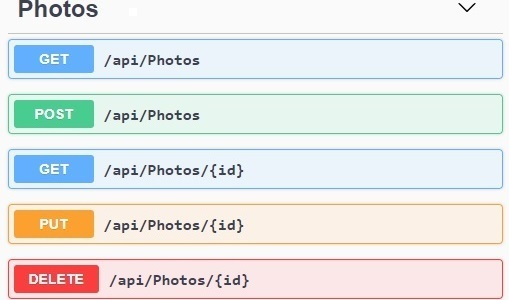

# PhotosApi
This is the Microservice in ASP.NET web API that was built to handle the Photo's workload:

## Additional Description
It is the API for my repository [PhotoGallery](https://github.com/moraeslucas/PhotoGallery).
 
More precisely, this Microservice handles the Photo's requests (Posts, etc):

